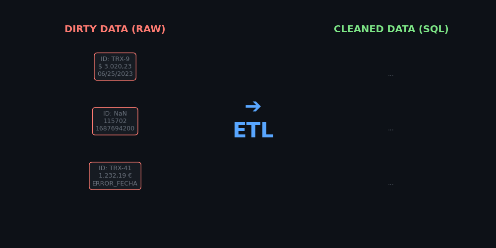

# 🕵️‍♂️ Financial Fraud Detection (AML) - ETL Pipeline




## 📌 Resumen del Proyecto
En este proyecto de Ingeniería y Análisis de Datos asumo el rol de un Data Engineer encargado de procesar un archivo bancario masivo (`transacciones_corruptas.csv`) que ha sufrido corrupción técnica en sus sistemas de origen.

El objetivo fue construir un **Pipeline ETL (Extract, Transform, Load)** robusto capaz de ingerir datos multidivisa, limpiarlos utilizando lógica vectorial y **Expresiones Regulares (Regex)**, para posteriormente cargarlos en una Base de Datos Relacional (`SQLite`) y utilizarlos en la detección preventiva de Fraude Transaccional empleando código **SQL puro**.

---

## 🏗️ La Arquitectura de este Pipeline

El proceso fue dividido en 4 fases técnicas:

### 1️⃣ Extract (La Extracción)
*   Lectura de 2,500 intentos de transacciones financieras.
*   Primer diagnóstico estructural usando Pandas para contabilizar valores Nulos, NaNs y corrupciones subyacentes.

### 2️⃣ Transform (Limpieza Quirúrgica en Pandas)
*   **Time Normalization:** Conversión de 4 formatos de fecha incompatibles simultáneos (Americano, Europeo, Unix Epoch) hacia el estándar internacional ISO-8601.
*   **Currency & Math Regex:** Extracción dinámica del texto (Yenes, Euros comerciales, Dólares sucios) y conversión matemática algorítmica a USD (Float64) limpiando caracteres tipográficos corruptos (`$, €, ¥`).
*   **Entity Resolution:** Diccionarios cruzados (Maps) para unificar la representación de países y comercios (Ej. `US`, `USA` -> `United States`).
*   **IP Security Validation:** Verificación computacional matemática para asegurar que cada dirección IPv4 contenga exactamente 4 octetos en el rango numérico (0 - 255).

### 3️⃣ Load (Carga Sqlite RDBMS)
*   Integración transaccional: Creación en duro de una base de datos local `fraude_financiero.db`.
*   Inserción automatizada (`df.to_sql`) del Dataframe 100% pulido hacia la tabla `transacciones`.

### 4️⃣ Analyze (SQL Puro y Analítica Anti-Fraude)
*   Integridad Analítica: Empleando la función `pd.read_sql_query`, inyecté **Consultas SQL Complejas** hacia mi motor de BD recién creado sin salir del Notebook.
*   Detección algorítmica: `GROUP BY` y `SUM` filtrados para extraer los **picos de fraude en horarios de madrugada (00:00 - 05:00 AM)** según región de IP.

---

## 🚀 Cómo ejecutar este Proyecto

1. Clonar el repositorio.
2. Instalar el entorno virtual y Requirements:
   ```bash
   python -m venv .venv
   .\.venv\Scripts\Activate.ps1
   pip install -r requirements.txt
   ```
3. Ejecutar el Script generador (para obtener el archivo defectuoso inicial):
   ```bash
   python src/generador_sucio.py
   ```
4. Abrir el notebook interactivo Jupyter:
   ```bash
   jupyter notebook notebooks/01_extraccion_limpieza.ipynb
   ```

*Nota: La carpeta `data/raw` está ignorada por defecto ya que las transacciones corruptas son generadas procesalmente in-situ mediante el generador provisto en `src/`.*

---
**Autor:** [Tu Nombre] | Portafolio de Data Analytics 2026
